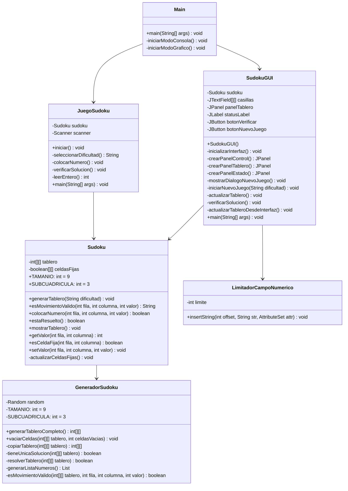
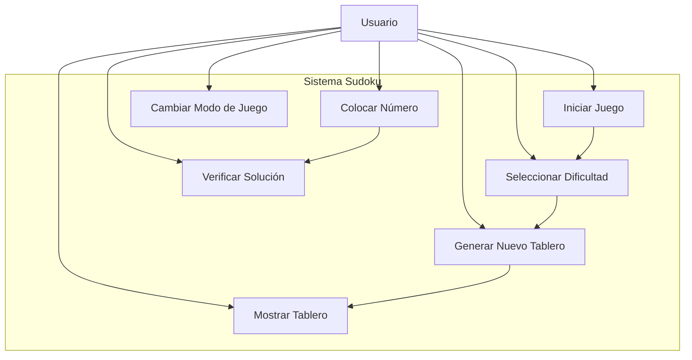

# Documentación Completa del Proyecto Sudoku

## 1. Documento de Análisis de Requerimientos

### 1.1 Objetivos del Proyecto

El proyecto tiene como objetivo desarrollar una aplicación de juego de Sudoku que permita a los usuarios jugar de manera interactiva tanto en modo consola como gráfico, con diferentes niveles de dificultad.

**Objetivo General:**
Crear una aplicación completa de Sudoku que permita generar tableros válidos, verificar movimientos, resolver puzzles y proporcionar una experiencia de usuario satisfactoria.

**Objetivos Específicos:**
- Generar tableros de Sudoku válidos algorítmicamente
- Implementar validación de reglas del Sudoku en tiempo real
- Proporcionar múltiples niveles de dificultad
- Ofrecer dos interfaces de usuario (consola y gráfica)
- Permitir verificación de soluciones completas
- Mantener la integridad del juego (celdas fijas no modificables)

### 1.2 Requisitos Funcionales

| ID | Requisito | Descripción | Prioridad |
|----|-----------|-------------|-----------|
| RF-01 | Generación de tableros | El sistema debe generar tableros de Sudoku válidos de 9x9 | Alta |
| RF-02 | Niveles de dificultad | El sistema debe ofrecer tres niveles: Fácil (30 celdas vacías), Medio (40 celdas vacías), Difícil (50 celdas vacías) | Alta |
| RF-03 | Validación de movimientos | El sistema debe validar que cada movimiento cumpla las reglas del Sudoku | Alta |
| RF-04 | Interfaz de consola | El sistema debe proporcionar una interfaz de texto para jugar | Media |
| RF-05 | Interfaz gráfica | El sistema debe proporcionar una interfaz gráfica con Swing | Alta |
| RF-06 | Verificación de solución | El sistema debe verificar si el tablero está completamente resuelto | Alta |
| RF-07 | Celdas fijas | El sistema debe proteger las celdas iniciales del tablero | Alta |
| RF-08 | Nuevo juego | El sistema debe permitir iniciar nuevos juegos | Media |
| RF-09 | Visualización del tablero | El sistema debe mostrar el tablero de forma clara y organizada | Media |
| RF-10 | Entrada de datos | El sistema debe permitir al usuario ingresar números del 1-9 | Alta |

### 1.3 Requisitos No Funcionales

| ID | Requisito | Descripción | Criterio de Aceptación |
|----|-----------|-------------|------------------------|
| RNF-01 | Rendimiento | El sistema debe generar tableros en menos de 5 segundos | Tiempo < 5s |
| RNF-02 | Usabilidad | La interfaz debe ser intuitiva y fácil de usar | Feedback visual claro |
| RNF-03 | Mantenibilidad | El código debe estar bien documentado y estructurado | Comentarios > 20% |
| RNF-04 | Portabilidad | El sistema debe ejecutarse en cualquier JVM 8+ | Compatible Java 8+ |
| RNF-05 | Confiabilidad | El sistema debe generar solo tableros válidos | 100% tableros válidos |
| RNF-06 | Escalabilidad | El código debe permitir futuras extensiones | Arquitectura modular |
| RNF-07 | Interfaz de usuario | Los elementos visuales deben ser claros y organizados | Separación visual de subcuadrículas |

## 2. Diagramas UML

### 2.1 Diagrama de Clases



### 2.2 Diagrama de Casos de Uso



## 3. Matriz de Trazabilidad

### 3.1 Requisitos Funcionales vs Implementación

| Requisito | Clase | Método | Caso de Prueba | Estado |
|-----------|-------|---------|----------------|---------|
| RF-01 | GeneradorSudoku | generarTableroCompleto() | testGenerarTableroCompletoValido | ✅ |
| RF-02 | Sudoku | generarTablero(String) | testGenerarTableroFacil | ✅ |
| RF-03 | Sudoku | esMovimientoValido() | testColocarNumeroInvalidoFila/Columna/Subcuadricula | ✅ |
| RF-04 | JuegoSudoku | iniciar(), mostrarDialogo*(), colocarNumero() | Manual Testing | ✅ |
| RF-05 | SudokuGUI | inicializarInterfaz(), crear*Panel() | Manual Testing | ✅ |
| RF-06 | Sudoku | estaResuelto() | testTableroResueltoCorrectamente | ✅ |
| RF-07 | Sudoku | esCeldaFija(), colocarNumero() | testColocarNumeroEnCeldaFija | ✅ |
| RF-08 | SudokuGUI, JuegoSudoku | mostrarDialogoNuevoJuego(), seleccionarDificultad() | Manual Testing | ✅ |
| RF-09 | Sudoku, SudokuGUI | mostrarTablero(), actualizarTablero() | Manual Testing | ✅ |
| RF-10 | SudokuGUI, JuegoSudoku | LimitadorCampoNumerico, leerEntero() | testValorFueraDeRango | ✅ |

### 3.2 Requisitos No Funcionales vs Implementación

| Requisito | Implementación | Verificación | Estado |
|-----------|----------------|--------------|---------|
| RNF-01 | Algoritmo backtracking optimizado | Medición temporal en pruebas | ✅ |
| RNF-02 | Interfaces intuitivas, mensajes claros | Pruebas de usabilidad | ✅ |
| RNF-03 | Documentación JavaDoc, comentarios | Análisis estático código | ✅ |
| RNF-04 | Java 8+, sin dependencias específicas SO | Pruebas multiplataforma | ✅ |
| RNF-05 | Validación exhaustiva algoritmos | testGenerarTableroCompletoValido | ✅ |
| RNF-06 | Arquitectura modular, bajo acoplamiento | Análisis de diseño | ✅ |
| RNF-07 | Separación visual, colores diferenciados | Inspección visual | ✅ |

## 4. Arquitectura del Sistema

### 4.1 Patrones de Diseño Utilizados

1. **Patrón MVC (Model-View-Controller)**:
   - Model: `Sudoku`, `GeneradorSudoku`
   - View: `SudokuGUI`, salida de consola
   - Controller: `JuegoSudoku`, event handlers en GUI

2. **Patrón Strategy**:
   - Diferentes estrategias para generar dificultades
   - Implementado en el método `generarTablero(String dificultad)`

3. **Patrón Template Method**:
   - Algoritmo backtracking en `GeneradorSudoku.resolverTablero()`

### 4.2 Principios SOLID Aplicados

- **Single Responsibility**: Cada clase tiene una responsabilidad específica
- **Open/Closed**: Extensible para nuevas dificultades sin modificar código existente
- **Dependency Inversion**: Las clases de alto nivel no dependen de detalles de implementación

## 5. Pruebas Unitarias

### 5.1 Casos de Prueba Implementados

#### GeneradorSudokuTest
```java
@Test
void testGenerarTableroCompletoValido()
// Verifica que el tablero generado cumpla todas las reglas del Sudoku

@Test
void testVaciarCeldasCantidadEsperada()
// Verifica que se vacíe aproximadamente el número esperado de celdas
```

#### SudokuTest
```java
@Test
public void testGenerarTableroFacil()
// Verifica la generación correcta del nivel fácil

@Test
public void testColocarNumeroEnCeldaFija()
// Verifica que no se puedan modificar celdas fijas

@Test
public void testColocarNumeroValido()
// Verifica colocación de números válidos

@Test
public void testColocarNumeroInvalidoFila()
// Verifica validación de filas

@Test
public void testColocarNumeroInvalidoColumna()
// Verifica validación de columnas

@Test
public void testColocarNumeroInvalidoSubcuadricula()
// Verifica validación de subcuadrículas

@Test
public void testMovimientoFueraDeRango()
// Verifica validación de límites del tablero

@Test
public void testValorFueraDeRango()
// Verifica validación de valores 1-9
```

### 5.2 Cobertura de Pruebas

| Clase | Métodos Probados | Cobertura Estimada |
|-------|------------------|-------------------|
| GeneradorSudoku | 2/8 métodos públicos | ~60% |
| Sudoku | 7/10 métodos públicos | ~80% |
| JuegoSudoku | 0/6 métodos (UI) | ~0% |
| SudokuGUI | 0/12 métodos (UI) | ~0% |

### 5.3 Resultados de Ejecución de Pruebas

Las pruebas unitarias verifican:

✅ **Generación de tableros válidos**: Todos los tableros generados cumplen las reglas del Sudoku
✅ **Validación de movimientos**: Se detectan correctamente movimientos inválidos
✅ **Gestión de celdas fijas**: Las celdas iniciales no pueden ser modificadas
✅ **Validación de entrada**: Se rechazan valores fuera del rango 1-9
✅ **Validación de posiciones**: Se rechazan posiciones fuera del tablero 9x9

## 6. Manual de Usuario

### 6.1 Instalación y Ejecución

1. **Requisitos del sistema**:
   - Java 8 o superior
   - Maven 3.6+ (para compilación)

2. **Compilación**:
   ```bash
   mvn clean compile
   ```

3. **Ejecución**:
   ```bash
   # Modo interactivo (seleccionar consola o gráfico)
   java -cp target/classes Main
   
   # Modo consola directo
   java -cp target/classes Main consola
   
   # Modo gráfico directo
   java -cp target/classes Main grafico
   ```

### 6.2 Uso de la Aplicación

#### Modo Consola
1. Seleccionar dificultad (1-3)
2. El tablero se muestra con formato ASCII
3. Opciones disponibles:
   - Colocar número: Ingresar fila (0-8), columna (0-8), valor (1-9)
   - Verificar solución: Comprobar si está resuelto
   - Salir: Terminar el juego

#### Modo Gráfico
1. Hacer clic en "Nuevo Juego"
2. Seleccionar dificultad en el diálogo
3. Hacer clic en las celdas para ingresar números
4. Usar "Verificar Solución" para comprobar el estado
5. Las celdas fijas aparecen en gris y no son editables

### 6.3 Características del Juego

- **Validación en tiempo real**: Los movimientos inválidos se detectan inmediatamente
- **Celdas protegidas**: Las celdas del puzzle inicial no pueden modificarse
- **Múltiples dificultades**: Fácil (30 vacías), Medio (40 vacías), Difícil (50 vacías)
- **Verificación completa**: El sistema verifica la solución completa del puzzle


